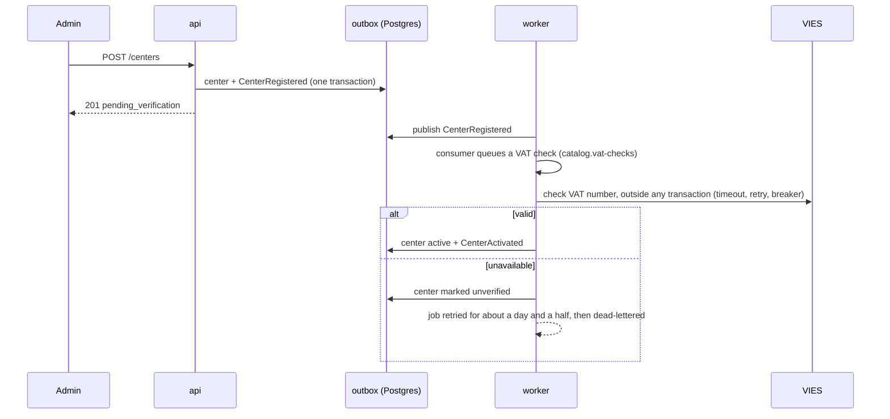

# Architecture

Tramo is a modular monolith (ADR 001) deployed as two processes built from one image.

## Containers

## Decision records

| ADR                                                                           | Title                                                          | Status   |
| ----------------------------------------------------------------------------- | -------------------------------------------------------------- | -------- |
| [001](adr/001-modular-monolith.md)                                            | Modular monolith with separate api and worker processes        | accepted |
| [002](adr/002-hexagonal-ddd-cqrs.md)                                          | Hexagonal modules with tactical DDD and CQRS                   | accepted |
| [003](adr/003-typeorm-data-mapper-and-unit-of-work.md)                        | TypeORM as a data mapper, unit of work through CLS             | accepted |
| [004](adr/004-transactional-outbox-bullmq.md)                                 | Transactional outbox, BullMQ delivery, idempotent consumers    | accepted |
| [005](adr/005-money-as-integer-cents.md)                                      | Money as integer cents, rates as basis points                  | accepted |
| [006](adr/006-problem-details-errors.md)                                      | RFC 9457 Problem Details for every error response              | accepted |
| [007](adr/007-testcontainers.md)                                              | Integration and e2e tests against real Postgres and Redis      | accepted |
| [008](adr/008-schema-per-module.md)                                           | One Postgres schema per module, no foreign keys across schemas | accepted |
| [009](adr/009-clock-port.md)                                                  | Time comes from an injectable Clock                            | accepted |
| [010](adr/010-uri-versioning-cursor-pagination.md)                            | URI versioning and cursor pagination                           | accepted |
| [011](adr/011-versioned-agent-tooling.md)                                     | Versioned coding-agent tooling                                 | accepted |
| [012](adr/012-toolchain-nest12-commonjs-jest.md)                              | NestJS 12 on CommonJS, TypeScript 6 and Jest                   | accepted |
| [013](adr/013-advisory-locks-for-session-families-and-startup-migrations.md)  | Advisory locks for session families and startup migrations     | accepted |
| [014](adr/014-field-level-encryption-for-payout-ibans-and-webhook-secrets.md) | Field-level encryption for payout IBANs and webhook secrets    | accepted |

## HTTP pipeline

Every request to the api goes through, in order: request id and CLS context, rate limiting,
validation, idempotency, the handler, auditing, and Problem Details rendering of errors.

- **Rate limiting.** A fixed window per client IP and route, counted in Redis by one Lua script so
  all api instances share the counters (`THROTTLE_LIMIT` per `THROTTLE_TTL_MS`). Routes declare
  stricter limits with `@Throttle`; health checks are exempt. Exceeding the limit returns 429 with
  `Retry-After`.
- **Idempotency.** Endpoints marked `@Idempotent()` require an `Idempotency-Key`. The key is
  scoped to the caller (user or API key), so idempotent routes must be authenticated. A short-lived "in progress" record (60 s) makes a
  concurrent duplicate fail fast with 409; a completed response is kept for 24 h and replayed with
  `Idempotent-Replayed: true`. The same key with a different method, path or body returns 422.
  Failed requests are not stored, so a client can fix the request and retry with the same key.
  The in-progress record is renewed while the handler runs; if the response cannot be stored after
  a success, the record is left to expire instead of being released: an immediate retry gets 409
  rather than running the operation a second time.
- **Audit log.** Endpoints marked `@Audited({ action, resource })` write one row to
  `shared.audit_log` per call: actor, action, resource, outcome, error code, request id and the
  changes the handler described through the `AuditTrail` port. The row is written after the
  handler's transaction, so failed and rolled-back attempts are recorded too.
- **Pagination.** Lists use keyset pagination on `(created_at, id)` with an opaque cursor
  (ADR 010); later pages do not shift when new rows arrive.

## Authentication

- **Sessions.** Access tokens are HS256 JWTs valid for 15 minutes. Refresh tokens are opaque,
  stored as SHA-256, single use and rotated on every refresh within a family. A family ends
  `SESSION_MAX_DAYS` (90) after sign-in however often it is refreshed.
- **Reuse.** A rotated refresh token presented again more than 10 seconds after its rotation is
  treated as stolen: the whole family is revoked and `RefreshTokenReuseDetected` is published.
  Within those 10 seconds it is rejected without revocation, because it is almost always the
  legitimate client retrying a request whose response it lost.
- **Lockout.** Sign-in attempts are counted per account, not per IP, so distributed guessing
  cannot avoid them. Each attempt is checked against the lock and counted in one Redis script
  before its password is verified, so parallel requests cannot all slip past the threshold; a
  success clears the count. The cost is that anyone can lock an account by failing on purpose; the lock is
  progressive and capped at an hour, the auth routes are rate limited per client, and the attempts
  are visible in the logs. A per-IP and device-cookie scheme would reduce that risk at the price of
  more state.
- **API keys.** Center keys carry explicit scopes and only reach endpoints that declare them.
  Routes opened to API keys are not implicitly open to users; they must also name roles.
- **Roles.** Users only reach routes that name their roles with `@Roles`; a route that forgets it
  refuses every user, since anyone can register as a student.
- **Rate limits.** Clients are counted per IPv4 address and per IPv6 /64 network. The queue
  dashboard (`/admin/queues`) sits outside Nest's guards and limits failed sign-ins itself (ten
  per client per 15 minutes).

Known gaps, accepted for now:

- `POST /auth/register` answers 409 for an email that already has an account, so registration
  reveals which emails are registered. Answering the same way in both cases needs an email
  confirmation step, which comes with the notifications module; until then the auth rate limit
  slows enumeration down.
- `StudentRegistered` and `CenterUserCreated` carry the email address, because the notifications
  module sends to it. Their jobs (and Bull Board, behind its own credentials) therefore hold it
  until completed jobs expire after seven days.
- An admin sets a new center administrator's first password. Production needs an invitation
  link, or a forced change on first sign-in, so the admin does not keep a working password.

## Catalog

Training centers and the programs students finance.

- **Center lifecycle.** An admin registers a center (`pending_verification`). The
  `CenterRegistered` consumer only queues a VAT check on `catalog.vat-checks`; that job asks VIES
  outside any transaction and saves the answer in a short one. A valid number activates the
  center. While VIES cannot answer, the center is marked `unverified` and the job is retried for
  about a day and a half (exponential from one minute) before it is dead-lettered; ops can also
  ask again with `POST /centers/:id/verify-vat`. A number that stops being valid leaves an active
  center active and emits `CenterVatInvalidated` for ops to decide. Only an admin changes a
  center's fee, payout account or status, and each change is an event (`CenterRenamed`,
  `CenterPlatformFeeChanged`, `CenterPayoutAccountChanged`, `CenterSuspended`...).
- **VIES client.** Each attempt has a timeout; transient failures and timeouts are retried twice
  with backoff, and a circuit breaker stops calling for 30 s after five failures in a row. Every
  failure becomes an `unavailable` answer: a registry outage never fails a request. `VIES_MODE`
  selects VIES, its test service or a local fake; production accepts only VIES.
- **Payout IBAN.** Stored encrypted (AES-256-GCM, ADR 014) and bound to its row, with its last four
  characters in clear; responses, events, logs and the audit log only show the masked value.
- **Programs.** Created as drafts and published once they have a financing option (instalment
  terms of 6 to 48 months, or an income share agreement capped at 1.0 to 2.0 times the price,
  offered only when at least 60 % of graduates find a job) and their center is active. The same
  rules are CHECK constraints on `catalog.programs`, and request validation reads its bounds from
  the domain. Changes to a published program are announced in full (`ProgramDetailsChanged`,
  `ProgramFinancingChanged`) so other modules keep their own copy. While a center is suspended,
  only Tramo admins change its programs.
- **Public catalog.** `GET /programs` reads a SQL read model that maps rows straight to DTOs:
  published programs of active centers, filtered by center, modality, product and price, newest
  first with keyset pagination on a partial index.
- **Optional authentication.** `GET /programs/:id` is open to anonymous callers and also reads
  the credentials when they are sent (`@OptionalAuthentication()`), so a center sees its own drafts.
  Invalid credentials are still rejected, but the route is public to the authorization guard, which
  therefore checks no roles or scopes: the use case does (`canSeeUnpublishedPrograms` requires
  `programs:read` or `programs:write` from an API key). Any new optional route has to do the same.

