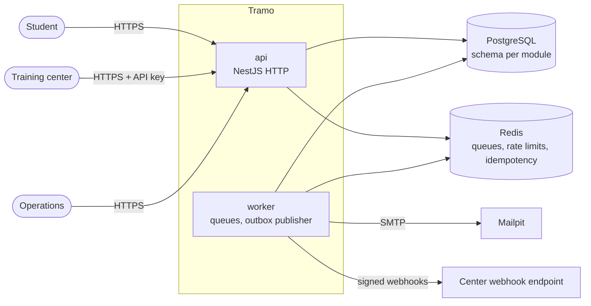

# Architecture

Tramo is a modular monolith (ADR 001) deployed as two processes built from one image.

## Containers

## Decision records

| ADR                                                    | Title                                                          | Status   |
| ------------------------------------------------------ | -------------------------------------------------------------- | -------- |
| [001](adr/001-modular-monolith.md)                     | Modular monolith with separate api and worker processes        | accepted |
| [002](adr/002-hexagonal-ddd-cqrs.md)                   | Hexagonal modules with tactical DDD and CQRS                   | accepted |
| [003](adr/003-typeorm-data-mapper-and-unit-of-work.md) | TypeORM as a data mapper, unit of work through CLS             | accepted |
| [004](adr/004-transactional-outbox-bullmq.md)          | Transactional outbox, BullMQ delivery, idempotent consumers    | accepted |
| [005](adr/005-money-as-integer-cents.md)               | Money as integer cents, rates as basis points                  | accepted |
| [006](adr/006-problem-details-errors.md)               | RFC 9457 Problem Details for every error response              | accepted |
| [007](adr/007-testcontainers.md)                       | Integration and e2e tests against real Postgres and Redis      | accepted |
| [008](adr/008-schema-per-module.md)                    | One Postgres schema per module, no foreign keys across schemas | accepted |
| [009](adr/009-clock-port.md)                           | Time comes from an injectable Clock                            | accepted |
| [010](adr/010-uri-versioning-cursor-pagination.md)     | URI versioning and cursor pagination                           | accepted |
| [012](adr/012-toolchain-nest12-commonjs-jest.md)       | NestJS 12 on CommonJS, TypeScript 6 and Jest                   | accepted |
